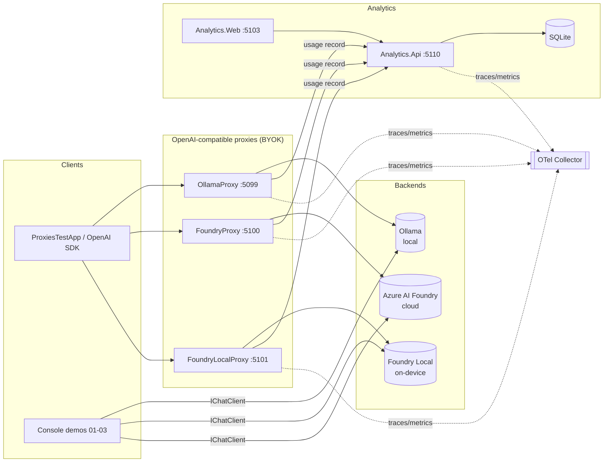

# PRD — Local AI with .NET (Samples-First Repository)

> **How to use this document:** Drop this file into your GitHub repo (e.g. `docs/PRD.md` or root `PRD.md`).
> Then use **GitHub Copilot (agent / coding agent mode)** or **Copilot Chat** with a prompt like
> *"Read `PRD.md` and scaffold the repository as specified. Start with Milestone M0, then M1…"*.
> Each component below is written as an independent, testable unit so Copilot can implement it in isolation.

| Field | Value |
|-------|-------|
| **Product** | `dotnet-local-ai` — a samples-first demo repository for running AI locally with .NET |
| **Companion talk** | "Local AI with .NET" (20–25 min) |
| **Related Build session** | **OD805** — *AI Building Blocks for .NET: Add intelligence to your C# apps* |
| **Reference implementation** | `github.com/elbruno/ElBruno.LLMProxies` |
| **Author / Owner** | Bruno Capuano (El Bruno) — Principal Cloud Advocate |
| **Status** | Draft v1 — ready for Copilot code generation |
| **Target .NET** | .NET 10 (LTS) |
| **License** | MIT |

---

## 1. Summary

`dotnet-local-ai` is a samples-first .NET solution that teaches and demonstrates **running Large Language Models locally** from C#, using **Microsoft.Extensions.AI** as the single abstraction seam. It contains two layers:

1. **Progressive console demos** (`01` → `04`) that map 1:1 to the session flow: the MEAI abstraction, Ollama, and **Foundry Local**.
2. **A companion Aspire sample** — the analytics dashboard/API now lives under `samples\09-analytics-aspire`, alongside the Foundry Local samples and the AI Chat template scenarios.

The through-line the code must prove: **one `IChatClient` interface — the app code never changes; only the backend endpoint does.** The repository keeps every runnable experience in `samples\` and presents them as isolated demos.

---

## 2. Problem statement & motivation

Developers adopting AI in .NET default to cloud APIs and hit four walls: **data privacy** (prompts leave the device), **cost** (per-token billing), **connectivity** (no offline story), and **latency**. Local inference solves these, but the tooling story is fragmented (Ollama vs. ONNX vs. Foundry Local) and there is no clear, .NET-idiomatic reference that shows how to keep app code stable while swapping backends — and how to observe usage once you do.

This repository is the missing reference: it proves that **Microsoft.Extensions.AI** decouples app logic from the model runtime, adds **Foundry Local** as a first-class on-device option, and keeps the sample catalog easy to follow.

---

## 3. Goals & non-goals

### 3.1 Goals
- **G1** — Demonstrate `IChatClient` (Microsoft.Extensions.AI) as the single seam across cloud, Ollama, and Foundry Local, with **zero app-code changes** when switching backends.
- **G2** — Ship a runnable **Foundry Local** demo: download → load → chat (streaming) → unload, entirely on-device with no Azure subscription.
- **G3** — Keep every runnable experience under `samples\` with clear, isolated setup instructions.
- **G4** — Keep the companion Aspire analytics sample runnable and discoverable as `samples\09-analytics-aspire`.
- **G5** — Preserve the template and local-agent samples as concise demos that are easy to follow in a live session.
- **G6** — Be **demo-safe**: everything starts with simple commands, uses small default models, and degrades gracefully when a backend is offline.

### 3.2 Non-goals
- **NG1** — Not a production-hardened gateway (no multi-tenant auth, rate limiting, or billing beyond illustrative analytics).
- **NG2** — No model training or fine-tuning.
- **NG3** — No full RAG / embeddings / MCP / Agent Framework implementation beyond the targeted samples — those live in **OD805**; this repo links to them but does not reimplement them (see §14, Future work).
- **NG4** — No mobile / MAUI clients.

---

## 4. Target audience & personas

| Persona | Need this repo serves |
|--------|------------------------|
| **.NET developer, AI-curious** | A copy-pasteable starting point to call a local model from C#. |
| **Solution architect** | A reference for keeping app code backend-agnostic and observable. |
| **Conference attendee (session follow-along)** | Numbered demos that match the talk's flow, runnable at home. |
| **Privacy/edge-focused team** | Proof that inference can run fully on-device / offline. |

---

## 5. Session context — how the code maps to the talk

The repository is the "code behind" the session flow. Copilot should keep this mapping intact so each project can be opened live on stage.

| Session block | Repo artifact |
|---------------|---------------|
| 1. Why local? (hook) | `README.md` intro + `docs/why-local.md` |
| 2. The seam: Microsoft.Extensions.AI | `01-meai-abstraction` |
| 3. Ollama + MEAI (recap) | `02-ollama` |
| 4. ⭐ Foundry Local (deep dive) | `03-foundry-local` |
| 5. Scenario: analytics companion | `samples/09-analytics-aspire/*` |
| 6. Close + bridge to OD805 | `docs/bridge-to-od805.md`, `docs/resources.md` |

---

## 6. Solution architecture



**Key architectural rules:**
- Every proxy exposes the **same OpenAI-compatible surface** (`/v1/chat/completions`, `/v1/models`) and forwards to exactly one backend.
- Proxies are **BYOK** (bring-your-own-key): they read the backend credential from configuration and never persist it.
- Every proxied call emits **one `UsageRecord`** to `Analytics.Api` (fire-and-forget, must never block or fail the user request).
- Console demos talk to backends **directly through `IChatClient`** — they do not go through the proxies (that keeps blocks 2–4 simple; the proxy layer is block 5).

---

## 7. Technology stack

| Concern | Choice | Notes |
|--------|--------|-------|
| Runtime | **.NET 10** | `global.json` pins the SDK. |
| AI abstraction | **Microsoft.Extensions.AI** (`IChatClient`, `IEmbeddingGenerator`) | The single seam. |
| Ollama client | `OllamaSharp` **or** `Microsoft.Extensions.AI.OpenAI` pointed at Ollama's OpenAI endpoint | Prefer OpenAI-compatible path for consistency. |
| Foundry Local | `Microsoft.AI.Foundry.Local` SDK + OpenAI client against its local endpoint | Manager → catalog → download → load → chat → unload. |
| Azure Foundry (cloud) | `Azure.AI.OpenAI` / `Microsoft.Extensions.AI.OpenAI` with `DefaultAzureCredential` | Keyless auth via CLI credential (as in OD805). |
| Web / proxies | **ASP.NET Core Minimal APIs** | One project per proxy. |
| Dashboard | **Blazor** (Server or Web App) | Matches OD805's Blazor UI. |
| Persistence | **SQLite** + **EF Core** | Matches OD805's SQLite store; zero external infra. |
| Orchestration | **.NET Aspire** (`AppHost`) | `aspire start` starts the whole graph. |
| Observability | **OpenTelemetry** (OTLP) + Aspire dashboard + collector | `infra/otel-collector`. |
| Solution format | `.slnx` | Modern solution file. |
| Tests | **xUnit** + `Microsoft.AspNetCore.Mvc.Testing` | Unit + integration. |
| Containerization | Optional `Dockerfile` per service | Nice-to-have, not required for M1–M5. |

**Default models (must be small for demo speed):**
- Ollama: `llama3.2:1b` (fallback `phi3:mini`)
- Foundry Local: `qwen2.5-0.5b` (fallback `phi-3.5-mini`)
- Azure Foundry (cloud): configurable deployment name (e.g. `gpt-4o-mini`)

---

## 8. Repository structure

```
dotnet-local-ai/
├─ README.md
├─ global.json
├─ dotnet-local-ai.slnx
├─ aspire.config.json
├─ .github/
│  ├─ copilot-instructions.md        # coding conventions for Copilot (see §12)
│  └─ workflows/ci.yml               # build + test
├─ docs/
│  ├─ PRD.md                         # this file
│  ├─ architecture.md
│  ├─ why-local.md
│  ├─ bridge-to-od805.md
│  ├─ resources.md
│  └─ runbook.md                     # how to run each demo live
├─ samples/
│  ├─ 01-meai-abstraction/           # G1 — one IChatClient, swap provider by config
│  ├─ 02-ollama/                     # G1/G3 — Ollama via IChatClient (streaming)
│  └─ 03-foundry-local/              # G2 — Foundry Local full lifecycle
├─ samples/
│  ├─ 09-analytics-aspire/           # Aspire companion sample moved from the old src tree
│  │  ├─ Shared/                     # DTOs, contracts, telemetry setup
│  │  ├─ analytics/
│  │  │  ├─ Analytics.Api/           # :5110
│  │  │  └─ Analytics.Web/           # :5103 (Blazor)
│  │  └─ AppHost/                    # .NET Aspire orchestration
│  ├─ 01-meai-abstraction/
│  ├─ 02-ollama/
│  └─ 03-foundry-local/
├─ infra/
│  └─ otel-collector/                # collector config
└─ tests/
   ├─ Proxies.Tests/
   ├─ Analytics.Tests/
   └─ Shared.Tests/
```

---

## 9. Component specifications

### 9.1 `samples/09-analytics-aspire/Shared` (class library)
**Purpose:** the contracts and helpers every service reuses.
- **Requirements**
  - `R-SH-1` Define OpenAI-compatible request/response DTOs (`ChatCompletionRequest`, `ChatCompletionResponse`, `ChatCompletionChunk`, `Message`, `Usage`, `ModelList`).
  - `R-SH-2` Define `UsageRecord` (see §10) and an `IUsageClient` with a resilient, fire-and-forget `ReportAsync(UsageRecord)`.
  - `R-SH-3` Provide `AddLocalAiTelemetry(this IHostApplicationBuilder)` extension that wires OpenTelemetry tracing + metrics + OTLP exporter with a shared service-name convention.
  - `R-SH-4` Define an `IChatBackend` abstraction with a single implementation strategy per proxy (so proxies share forwarding + logging logic).

### 9.2 `samples/01-meai-abstraction` (console)
**Purpose:** prove G1 — the same code, different provider by configuration.
- `R-01-1` Resolve an `IChatClient` from configuration key `Ai:Provider` ∈ { `ollama`, `foundrylocal`, `azurefoundry` }.
- `R-01-2` Send a fixed prompt and print a **streaming** response.
- `R-01-3` Switching provider must require **only** a config/env change — no code recompilation of business logic.
- **Acceptance:** running with each provider value yields a completion; a diff of the "business" code path across providers is empty.

### 9.3 `samples/02-ollama` (console)
**Purpose:** the Ollama recap (session block 3).
- `R-02-1` Connect to Ollama's OpenAI-compatible endpoint (`http://localhost:11434/v1`) via `IChatClient`.
- `R-02-2` Demo a **sentiment-analysis** prompt (callback to OD805) and stream the result.
- `R-02-3` Detect Ollama-offline and print an actionable message (`ollama serve`, `ollama pull llama3.2:1b`).

### 9.4 `samples/03-foundry-local` (console) — ⭐ the deep dive
**Purpose:** G2 — full Foundry Local lifecycle on-device.
- `R-03-1` Use the Foundry Local SDK/manager to: **discover execution providers**, **download** the default model, **load** it, obtain an OpenAI-compatible **chat client**, run a **non-streaming** and a **streaming** completion, then **unload** the model.
- `R-03-2` Surface the selected **execution provider** (CPU/GPU/NPU) in console output to make the hardware-acceleration story visible.
- `R-03-3` Expose the same call through `IChatClient` so the code shape matches `01` and `02`.
- `R-03-4` Pre-flight check: if the `foundry` service/CLI is not available, print setup guidance and exit non-zero.
- **Acceptance:** on a clean machine (no prior model), the sample downloads, loads, answers, and unloads with visible progress and no Azure sign-in.

### 9.5 Proxies — `OllamaProxy` / `FoundryProxy` / `FoundryLocalProxy`
All three share the same contract; only the backend differs.
- `R-PX-1` Expose `POST /v1/chat/completions` supporting both `stream:true` (SSE) and `stream:false`.
- `R-PX-2` Expose `GET /v1/models` returning the backend's available models in OpenAI shape.
- `R-PX-3` Expose `GET /health` (liveness) and `GET /health/backend` (backend reachability).
- `R-PX-4` **BYOK:** read backend credentials/endpoint from configuration; never log or persist secrets.
- `R-PX-5` After each request, emit one `UsageRecord` to `Analytics.Api` via `IUsageClient` — **non-blocking**, must not affect the response if analytics is down.
- `R-PX-6` Propagate/START an OpenTelemetry span per request with attributes: `proxy.name`, `backend`, `model`, `tokens.total`, `latency.ms`, `success`.
- `R-PX-7` Ports are fixed for demo predictability: **5099 / 5100 / 5101**.
- `R-PX-8` Graceful backend-down behavior: return an OpenAI-shaped error object with HTTP 502 and record a failed `UsageRecord`.

| Proxy | Port | Backend | Auth |
|-------|------|---------|------|
| `OllamaProxy` | 5099 | Ollama local (`/v1`) | none |
| `FoundryProxy` | 5100 | Azure AI Foundry (cloud) | `DefaultAzureCredential` (keyless) |
| `FoundryLocalProxy` | 5101 | Foundry Local (on-device) | none |

### 9.6 `Analytics.Api` (:5110, Minimal API + EF Core/SQLite)
- `R-AN-1` `POST /api/usage` — ingest a `UsageRecord` (validate, persist).
- `R-AN-2` `GET /api/usage?from=&to=&backend=&model=` — filtered list (paged).
- `R-AN-3` `GET /api/usage/summary` — aggregates: total requests, total tokens, avg latency, error rate, and breakdowns by `backend` and `model`.
- `R-AN-4` `GET /api/usage/timeseries?bucket=minute|hour` — requests & tokens over time.
- `R-AN-5` Auto-create/migrate the SQLite schema on startup; seed nothing by default.
- `R-AN-6` OpenTelemetry instrumented; OpenAPI/Swagger enabled in Development.

### 9.7 `Analytics.Web` (:5103, Blazor)
- `R-WEB-1` Dashboard page with KPI cards: **Total requests**, **Total tokens**, **Avg latency (ms)**, **Error rate %**.
- `R-WEB-2` Charts: requests over time (line), tokens by backend (bar), latency distribution, success vs error (donut).
- `R-WEB-3` A live table of the most recent requests (auto-refresh every N seconds).
- `R-WEB-4` A filter bar (time range, backend, model). All data comes from `Analytics.Api` — no direct DB access.
- `R-WEB-5` Must render with **empty data** (fresh DB) without errors.

### 9.8 `ProxiesTestApp` (console)
- `R-TA-1` Send an **identical prompt** to all three proxies and print each response side-by-side with token/latency, proving the OpenAI surface is uniform.
- `R-TA-2` Configurable target subset (e.g. `--only foundrylocal`) so a demo can skip an offline backend.

### 9.9 `samples/09-analytics-aspire/AppHost` (.NET Aspire)
- `R-AH-1` Reference and start: the three proxies, `Analytics.Api`, `Analytics.Web`, and the OTel collector; wire service discovery so `Analytics.Web` → `Analytics.Api` and proxies → `Analytics.Api` resolve by name.
- `R-AH-2` Expose the Aspire dashboard with all endpoints and live traces.
- `R-AH-3` Pass backend endpoints/credentials as Aspire configuration/parameters (no secrets in code).
- `R-AH-4` `aspire start` brings the full graph up in the background with one command.

---

## 10. Data model — `UsageRecord`

```csharp
public sealed record UsageRecord
{
    public Guid Id { get; init; }                 // server-assigned if empty
    public DateTimeOffset TimestampUtc { get; init; }
    public string ProxyName { get; init; }         // "OllamaProxy" | "FoundryProxy" | "FoundryLocalProxy"
    public string Backend { get; init; }           // "ollama" | "azurefoundry" | "foundrylocal"
    public string Model { get; init; }
    public int PromptTokens { get; init; }
    public int CompletionTokens { get; init; }
    public int TotalTokens { get; init; }
    public double LatencyMs { get; init; }
    public bool Success { get; init; }
    public string? ErrorType { get; init; }        // null when Success
    public string? ClientId { get; init; }         // optional caller correlation
}
```
- `R-DM-1` `TotalTokens` must equal `PromptTokens + CompletionTokens` when both are known; if the backend does not return usage, estimate and flag with `ErrorType = null` but set a `TokensEstimated` boolean (add to the record).
- `R-DM-2` Persist UTC timestamps; the dashboard converts to local time for display.

---

## 11. Configuration & conventions

- `R-CF-1` All ports, endpoints, model names, and the `Analytics.Api` URL come from `appsettings.json` + environment overrides; **no hard-coded secrets**.
- `R-CF-2` Environment variable convention: `AI__PROVIDER`, `OLLAMA__ENDPOINT`, `FOUNDRYLOCAL__MODEL`, `AZUREFOUNDRY__ENDPOINT`, `AZUREFOUNDRY__DEPLOYMENT`, `ANALYTICS__BASEURL`.
- `R-CF-3` Provide `.env.example` / `appsettings.Development.json` templates with safe defaults.
- `R-CF-4` A root `README.md` "Quick start" that works in ≤ 5 commands.

---

## 12. `.github/copilot-instructions.md` (Copilot coding conventions)

Copilot must generate code that follows these rules (also emit them into `.github/copilot-instructions.md`):
- Target **.NET 10**, nullable enabled, implicit usings on, `TreatWarningsAsErrors` in CI.
- Prefer **Minimal APIs**, `record` DTOs, `System.Text.Json` (source-gen where hot).
- Use **`IChatClient`** everywhere a model is called — never call a vendor SDK directly from business logic; wrap it behind DI.
- **Async all the way**, `CancellationToken` on every I/O method, no `.Result`/`.Wait()`.
- Register services via extension methods (`AddXxx`); keep `Program.cs` thin.
- No secrets in source; read from configuration/user-secrets.
- Every HTTP service: health checks + OpenTelemetry + graceful backend-failure handling.
- Every new project must build with `dotnet build` and be covered by at least one test.

---

## 13. Non-functional requirements

| ID | Requirement |
|----|-------------|
| `NFR-1` (Performance) | Proxy overhead over the raw backend call ≤ 50 ms p95 (excluding model inference). |
| `NFR-2` (Resilience) | Analytics outage must not affect proxied completions (fire-and-forget, timeout ≤ 500 ms). |
| `NFR-3` (Offline) | `01`, `02`, `03`, and the `*Local*` path must work with **no internet** once models are pulled. |
| `NFR-4` (Security) | BYOK secrets only from config/user-secrets; never logged, never in `UsageRecord`. |
| `NFR-5` (Observability) | 100% of proxied requests produce a trace span and a `UsageRecord`. |
| `NFR-6` (Portability) | Runs on Windows and macOS; Foundry Local sample notes platform/hardware requirements. |
| `NFR-7` (Demo-safety) | Fresh clone → `aspire start` succeeds even if one backend is offline (that backend's proxy reports unhealthy, others work). |

---

## 14. Testing & acceptance

### 14.1 Test strategy
- **Unit** (`Shared.Tests`): DTO (de)serialization round-trips against OpenAI JSON fixtures; `UsageRecord` invariants; telemetry setup.
- **Integration** (`Proxies.Tests`): each proxy with a **stub backend** — asserts OpenAI-shaped output, streaming SSE framing, a `UsageRecord` is emitted, and backend-down → 502 + failed record.
- **Integration** (`Analytics.Tests`): API CRUD + summary/timeseries math against an in-memory/SQLite DB.
- **Smoke** (optional): `ProxiesTestApp` run in CI against stub backends.

### 14.2 Definition of Done (per milestone)
A milestone is done when: code builds warning-free, its tests pass, `docs/runbook.md` has its run steps, and it can be demoed live from a clean clone.

---

## 15. Milestones (Copilot build order)

| Milestone | Scope | Maps to session block |
|-----------|-------|-----------------------|
| **M0 — Scaffold** | Solution `.slnx`, `global.json`, `samples/09-analytics-aspire/Shared` (DTOs + `UsageRecord` + telemetry ext), CI workflow, README skeleton. | — |
| **M1 — The seam** | `samples/01-meai-abstraction` (provider-by-config, streaming). | Block 2 |
| **M2 — Ollama** | `samples/02-ollama` (sentiment, streaming, offline guidance). | Block 3 |
| **M3 — Foundry Local** ⭐ | `samples/03-foundry-local` (full lifecycle, EP visibility). | Block 4 |
| **M4 — Proxies** | `OllamaProxy`, `FoundryProxy`, `FoundryLocalProxy` + `ProxiesTestApp`. | Block 5 |
| **M5 — Analytics** | `Analytics.Api` + `Analytics.Web` + usage wiring from proxies. | Block 5 |
| **M6 — Aspire + OTel** | `samples/09-analytics-aspire/AppHost`, `infra/otel-collector`, one-command run, dashboards. | Block 5 |
| **M7 — Docs & polish** | `bridge-to-od805.md`, `resources.md`, `why-local.md`, runbook, diagrams. | Blocks 1 & 6 |

Each milestone is independently shippable and demoable.

---

## 16. Acceptance criteria (repository-level checklist)

- [ ] `git clone` → `dotnet build dotnet-local-ai.slnx` succeeds with zero warnings.
- [ ] `samples/01` runs against all three providers by config change only (G1).
- [ ] `samples/03` downloads, loads, streams, and unloads a Foundry Local model with no Azure sign-in (G2).
- [ ] All three proxies answer `/v1/chat/completions` (stream + non-stream) with an identical OpenAI contract (G3).
- [ ] Every proxied call appears in the Blazor dashboard within one refresh cycle (G4).
- [ ] `aspire start` starts proxies + analytics + collector; Aspire dashboard shows live traces (G5).
- [ ] Killing one backend does not break the others; its proxy reports unhealthy (NFR-7).
- [ ] `docs/bridge-to-od805.md` explains the connection to OD805 and links `aka.ms/dotnet-ai`.

---

## 17. Bridge to OD805 (content for `docs/bridge-to-od805.md`)

This repo is the **local-first foundation** under the broader building blocks shown in **OD805 — *AI Building Blocks for .NET: Add intelligence to your C# apps***. In OD805 the same chat client connects to cloud or local without changing the flow; here we go deep on the local half, add **Foundry Local** as a first-class on-device option, and show a production-shaped proxy + analytics + Aspire layer. Natural next steps (in OD805, not reimplemented here): embeddings/RAG with a SQLite vector store, Model Context Protocol (MCP) tools, and Microsoft Agent Framework multi-agent workflows.

---

## 18. Future work / out of scope (this repo)
- Embeddings + RAG pipeline (markdown → chunk → embed → SQLite vector store).
- MCP server/tool integration (e.g. Microsoft Learn MCP).
- Agent Framework + A2A multi-agent demo.
- Auth, rate limiting, and multi-tenant quotas on the proxies.
- Container images + a deploy target (Azure Container Apps).

---

## 19. Resources (content for `docs/resources.md`)
- .NET + AI hub: `https://aka.ms/dotnet-ai`
- AI apps for .NET: `https://aiappsfor.net`
- Foundry Local — Get started (C#): `https://learn.microsoft.com/azure/foundry-local/get-started?pivots=programming-language-csharp`
- Reference implementation: `https://github.com/elbruno/ElBruno.LLMProxies`
- Build session OD805 (companion talk).

---

## 20. Glossary
- **MEAI** — Microsoft.Extensions.AI; provides `IChatClient` / `IEmbeddingGenerator` abstractions.
- **BYOK** — Bring Your Own Key; the proxy uses the operator's backend credential.
- **EP (Execution Provider)** — the hardware/runtime backend (CPU/GPU/NPU) selected by Foundry Local's ONNX runtime.
- **OpenAI-compatible** — an HTTP surface matching OpenAI's `/v1/chat/completions` schema, so any OpenAI SDK can target it by changing the base URL.
- **OTel** — OpenTelemetry; vendor-neutral traces/metrics/logs.
```

---

*Companion PRD for the "Local AI with .NET" session. Bridges to Build session OD805.*
